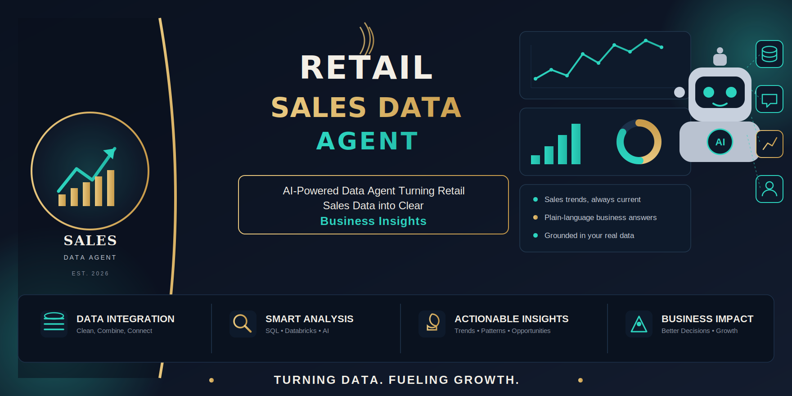

  

<h1 align="center">🛍️ Retail Sales Data Agent</h1>

  Building an AI-powered Data Agent to turn retail sales data into clear business insights.

  
  
  
  

  <b>SQL • Databricks • AI-Powered Analytics • Business Insights</b>

---

# 🛍️ Building a Retail Sales Data Agent on Databricks

## 📌 Project Overview

This project was completed as part of my BrightLearn AI and Data Skills learning journey.

The aim of the project was to build a working **Retail Sales Data Agent** in Databricks that allows a business user to ask questions about retail sales data in plain language and receive useful, data-driven answers.

Instead of requiring a manager or business owner to write SQL queries, the Data Agent makes it possible to ask questions naturally, such as:

> Which product category is performing best?

> What are the main sales trends?

> What opportunities should the business focus on?

The agent then uses the connected retail sales dataset to answer the question based on the available data.

This project gave me the opportunity to work through the full data analytics process: understanding the data, preparing it for analysis, building an AI-powered Data Agent, testing its responses, validating the results, and communicating insights in a way that makes sense to a business user.

---

# 🎯 Project Objective

The objective of this project was to build a Retail Sales Data Agent in Databricks using the provided retail sales dataset.

The agent was designed to help a business user, manager, or decision-maker explore the shop's sales performance and receive useful insights in plain language.

The project focused on making sure that the agent could:

* Answer questions using the connected dataset
* Analyse sales performance and trends
* Explore customer purchasing behaviour
* Compare product categories
* Identify useful patterns and potential business opportunities
* Explain findings in clear business language
* Avoid making up information that is not available in the data

The goal was not simply to create an AI agent that gives answers, but to create one that gives answers that are **grounded in the data and useful for decision-making**.

---

# 🛠️ Tools Used

The following tools were used in this project:

* **Databricks** – for storing, preparing, and exploring the data
* **Databricks Genie Space** – for building the natural-language Data Agent
* **SQL** – for exploring and validating the data
* **GitHub** – for documenting and presenting the completed project

---

# 📊 Dataset Overview

The project uses a retail sales transaction dataset containing information about customer purchases.

The dataset was prepared in Databricks as:

**`retail_sales_data`**

The dataset contains the following columns:

| Column           | Description                                 |
| ---------------- | ------------------------------------------- |
| Transaction ID   | Unique identifier for each transaction      |
| Date             | Date when the transaction took place        |
| Customer ID      | Unique identifier for each customer         |
| Gender           | Gender information available in the dataset |
| Age              | Customer age                                |
| Product Category | Category of the product purchased           |
| Quantity         | Number of units purchased                   |
| Price per Unit   | Price of one unit                           |
| Total Amount     | Total value of the transaction              |

This data makes it possible to explore sales, customers, product categories, and trends over time.

Before building the agent, I reviewed the dataset to understand what information was available and what questions could realistically be answered. This was important because a good Data Agent needs to understand the data it is working with and should not try to answer questions that the dataset cannot support.

---

# 🔄 Project Journey and Methodology

## Step 1: Upload the Dataset

The first step was to upload the retail sales dataset into Databricks.

I checked the dataset preview and made sure that the data was available before moving on to the next stage.

📸 **Evidence:** Screenshots of the uploaded dataset, preview, and file location are included in the project documentation.

---

## Step 2: Review and Understand the Data

Before creating the Data Agent, I spent time reviewing the dataset.

I looked at:

* The available columns
* The type of information in each column
* Sample values
* Data ranges
* Missing or unusual values
* Potential data quality issues

This step helped me understand which business questions the dataset could answer and which questions would be outside the scope of the available data.

---

## Step 3: Prepare the Dataset for the Agent

The dataset was prepared and registered as a table in Databricks so that it could be connected to the Data Agent.

I used the table name:

**`retail_sales_data`**

Clear descriptions were added to help provide context about the table and its columns.

Preparing the data properly was important because the Data Agent relies on the structure and meaning of the connected data to interpret business questions correctly.

---

## Step 4: Create the Retail Sales Data Agent

I created a Data Agent in Databricks and connected it to the `retail_sales_data` table.

The purpose of the agent was to make the data easier to explore through natural-language questions.

Rather than asking a user to understand SQL, the agent allows them to ask questions in a more natural way and receive answers based on the underlying data.

I also tested the connection to make sure that the agent could successfully access the dataset before moving on to more detailed questions.

---

# 🤖 My Agent Instructions

One of the most important parts of this project was deciding how the agent should behave.

I created instructions to guide the agent on:

* Its role and purpose
* The type of users it is helping
* The dataset it should use
* The types of questions it should answer
* How to explain results in business language
* How to handle unclear questions
* How to respond when information is missing
* How to avoid making up data
* When it is appropriate to make a recommendation

My approach was to make sure the agent focused on the data that was actually available and communicated findings clearly.

### My guiding principles for the agent were:

**Use the data as the source of truth.**
The agent should base its answers on the connected dataset and should not invent numbers, categories, or information.

**Be clear and easy to understand.**
The answers should focus on what the results mean for the business rather than using unnecessary technical language.

**Recognise the limits of the data.**
If the information needed to answer a question is not available, the agent should say so rather than guessing.

**Focus on meaningful insights.**
Where the data supports it, the agent should identify trends, patterns, risks, and opportunities that could help the business make better decisions.

> **Note:** The full version of my original agent instructions, exactly as entered into Databricks, is included in my project documentation and supporting evidence.

---

# 💬 Testing the Data Agent

Once the Data Agent was set up and the instructions were saved, I tested it using a range of business questions.

I made sure to test different types of questions so that I could see how the agent handled both simple and more analytical requests.

The questions covered areas such as:

* Overall sales performance
* Product category performance
* Customer behaviour
* Customer spending patterns
* Sales trends over time
* Growth opportunities
* Business risks
* Recommendations supported by the data

I tested **at least 10 business questions** to understand how well the agent responded to different types of requests.

For each question, I reviewed:

1. The question asked
2. The answer provided by the agent
3. Any charts, tables, or summaries produced

This helped me evaluate not only whether the agent could answer questions, but also whether its answers were useful and understandable from a business perspective.

---

# 🔎 Validating the Agent's Answers

One of the most important lessons from this project was that an AI answer should not simply be accepted because it sounds confident.

To check the reliability of the Data Agent, I independently validated at least three of its answers against the underlying data.

I used SQL and other available data checks to compare the agent's responses with the source data.

For each validation, I considered:

* What answer did the agent give?
* What does the underlying data show?
* Does the evidence support the answer?
* Was the answer correct, partially correct, or incorrect?

This part of the project helped me understand the importance of validation in data analytics.

An AI tool can make analysis faster, but it is still important for a Data Analyst to check important findings and understand where the results come from.

---

# 💡 Key Insights

The analysis highlighted several patterns that could be useful for business decision-making.

Some of the key areas explored included:

### 📈 Revenue and Sales Performance

The data was used to explore how sales performance changed and where the business was generating the most value.

### 👥 Customer Behaviour

The analysis explored customer purchasing behaviour and differences in customer contribution to revenue.

This is important because understanding customers can help a business identify opportunities to encourage repeat purchases and increase customer value.

### 🛒 Product Category Performance

The project compared product categories to understand how different categories contributed to sales and revenue.

This can help management identify areas that may deserve more attention and areas that require further investigation.

### 📅 Trends Over Time

The transaction date was used to explore changes in sales over time.

Looking at trends can help a business identify stronger and weaker periods and ask further questions about what may be influencing performance.

---

# ⚠️ Important Data Limitations

A key part of responsible data analysis is understanding what the data cannot tell us.

The dataset can provide insights about sales transactions, customers, product categories, quantities, and spending.

However, conclusions should not be made about information that is not included in the dataset.

For example, the available data does not provide enough information to reliably analyse areas such as:

* Customer satisfaction
* Customer feedback
* Store locations
* Reasons why customers do or do not return
* Online versus in-store purchasing behaviour

Recognising these limitations helped me ensure that the analysis remained realistic and grounded in the available data.

---

# 🚀 Business Recommendations

Based on the findings generated from the data, recommendations should always be linked to evidence rather than assumptions.

The analysis suggests that management can use the data to explore opportunities such as:

### 1. Focus on Customer Value and Retention

Understanding which customers contribute the most value can help the business think about how to encourage stronger relationships and repeat purchases.

### 2. Explore Opportunities to Increase Transaction Value

The business can investigate ways to encourage customers to purchase more items or increase the value of each transaction.

Possible strategies could include bundles or targeted promotions, provided that the data supports these opportunities.

### 3. Monitor Product Category Performance

Regularly reviewing category performance can help management identify changes in customer demand and make more informed decisions about priorities.

### 4. Use Trends to Support Planning

Time-based sales patterns can help management identify stronger and weaker periods and plan promotions, stock, and business activities more effectively.

The main lesson from this project is that recommendations are strongest when they are connected directly to evidence from the data.

---

# 🧠 What I Learned

This project taught me much more than how to create an AI-powered Data Agent.

I learned the importance of:

* Understanding the data before analysing it
* Asking meaningful business questions
* Giving an AI agent clear instructions
* Recognising the limitations of a dataset
* Validating AI-generated answers
* Communicating insights in simple language
* Connecting data analysis to real business decisions

One of my biggest lessons was that **AI does not remove the need for analytical thinking**.

The AI agent can make data easier to access and explore, but a Data Analyst still needs to understand the data, ask the right questions, check important results, and communicate the findings responsibly.

---

# 📁 Project Deliverables

This repository contains the evidence and documentation for my completed project, including:

* The project documentation
* My Retail Sales Data Agent project journey
* Dataset information
* Evidence of data preparation
* Agent setup information
* My original agent instructions
* Screenshots from the project process
* Business questions tested
* Validation of selected answers
* Key insights and recommendations

---

# 🔮 What I Would Improve in Future

If I were to develop this project further, I would like to:

* Test the agent with more complex business questions
* Add additional visualisations and dashboards
* Compare more AI-generated answers with manually written SQL queries
* Explore a larger dataset with a longer period of sales history
* Add more business information to support deeper analysis
* Continue improving the agent instructions based on testing results

This would allow me to test the agent in more situations and gain an even deeper understanding of how AI can support data-driven decision-making.

---

# 🏁 Conclusion

This project was my opportunity to build a Data Agent from start to finish and see how AI and data analytics can work together in a practical business setting.

I started by understanding and preparing the retail sales data, then created and configured a Data Agent in Databricks, tested it with business questions, and validated selected answers against the underlying data.

The project showed me that making data accessible is just as important as analysing it. A business user may have valuable questions but may not know SQL or how to explore a database. A well-designed Data Agent can help bridge that gap by allowing users to interact with data using natural language.

At the same time, this project reinforced the importance of checking results and understanding the limitations of the data.

Overall, this project has helped me develop my skills in **SQL, Databricks, data analysis, AI-powered analytics, business thinking, and data storytelling**. It is an important step in my journey towards becoming a Data Analyst.

---

## 👩🏾‍💻 Author

**Alice Musindo**

Data Analyst | SQL | Databricks | Excel | Power BI | Data Analytics | Data Studio | Databricks

🌱 *Learning, building, validating, and turning data into meaningful insights—one project at a time.*

For more information, see the [LICENSE](LICENSE) file for details.

